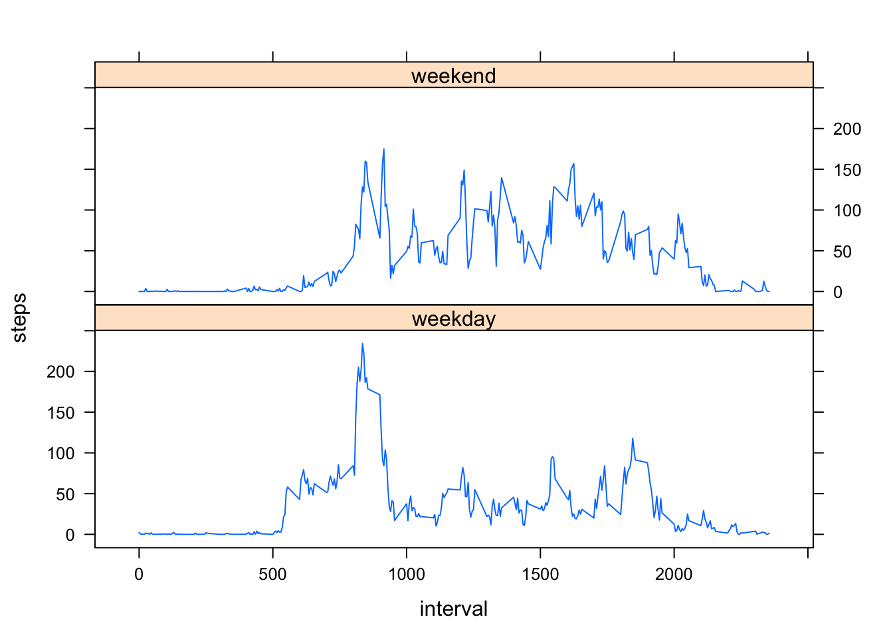

# Reproducible Research: Peer Assessment 1


## Loading and preprocessing the data

### 1. Load the data (i.e. read.csv())


```r
setwd("/Users/rong/Dropbox/code/GitHub/Coursera/Data Science/Reproduce Data/PA/RepData_PeerAssessment1")
data_raw=read.csv("./activity.csv", na.strings="?",colClasses=c("numeric","character","numeric"))
```

### 2. Process/transform the data (if necessary) into a format suitable for your analysis


```r
data_raw$date <- strptime(data_raw$date, "%Y-%m-%d")
data<-data_raw[!is.na(data_raw$steps),]
head(data_raw)
```

```
##   steps       date interval
## 1    NA 2012-10-01        0
## 2    NA 2012-10-01        5
## 3    NA 2012-10-01       10
## 4    NA 2012-10-01       15
## 5    NA 2012-10-01       20
## 6    NA 2012-10-01       25
```

## What is mean total number of steps taken per day?


### 1. Make a histogram of the total number of steps taken each day


```r
library(plyr)
daily_step<-ddply(data,.(date), summarise, steps=sum(steps))
# png(filename="figure/1.png")
hist(daily_step$steps,main="Histogram of daily steps", xlab="the total number of steps taken each day")
```


```r
# dev.off()
```


### 2. Calculate and report the mean and median total number of steps taken per day


```r
# the mean and median total number of steps taken per day
mean(daily_step$steps)
```

```
## [1] 10766
```

```r
median(daily_step$steps)
```

```
## [1] 10765
```


## What is the average daily activity pattern?

### 1. Make a time series plot (i.e. type = "l") of the 5-minute interval (x-axis) and the average number of steps taken, averaged across all days (y-axis)


```r
# Make a time series plot (i.e. type = "l") of the 5-minute interval (x-axis) and the average number of steps taken, averaged across all days (y-axis)

daily_pattern <- ddply(data, .(interval), summarise, avgsteps = mean(steps))
# png(filename="figure/2.png")
plot(daily_pattern$interval, daily_pattern$avgsteps, type="l", xlab="5-min interval", ylab="Average steps", main="Average Daily Pattern")
```


```r
# dev.off()
```


### 2. Which 5-minute interval, on average across all the days in the dataset, contains the maximum number of steps?


```r
# Which 5-minute interval, on average across all the days in the dataset, contains the maximum number of steps?

daily_pattern[daily_pattern$avgsteps==max(daily_pattern$avgsteps),]
```

```
##     interval avgsteps
## 104      835    206.2
```

## Imputing missing values
### 1. Calculate and report the total number of missing values in the dataset (i.e. the total number of rows with NAs)


```r
# Number of missing values
sum(is.na(data_raw$steps))
```

```
## [1] 2304
```

### 2. Devise a strategy for filling in all of the missing values in the dataset. The strategy does not need to be sophisticated. For example, you could use the mean/median for that day, or the mean for that 5-minute interval, etc.


```r
# Fill the NA's with avgstep
mergedata<- arrange(join(data,daily_pattern),interval)
```

```
## Joining by: interval
```


### 3. Create a new dataset that is equal to the original dataset but with the missing data filled in.


```r
# the new dataset
mergedata$steps[is.na(mergedata$steps)] <- mergedata$avesteps[is.na(mergedata$steps)]
```

### 4.Make a histogram of the total number of steps taken each day and Calculate and report the mean and median total number of steps taken per day. Do these values differ from the estimates from the first part of the assignment? What is the impact of imputing missing data on the estimates of the total daily number of steps?


```r
# plot the histogram
new_daily_steps <- ddply(mergedata, .(date), summarise, steps = sum(steps))
# png(filename="figure/3.png")
hist(new_daily_steps$steps, main = "Number of Steps", xlab = "steps taken each day",  )
```


```r
# dev.off()

# mean and median total number of steps taken per day don't change
# significantly
mean(new_daily_steps$steps)
```

```
## [1] 10766
```

```r
median(new_daily_steps$steps)
```

```
## [1] 10765
```

```r
daily_steps_1 <- sum(data$steps)
daily_steps_2 <- sum(mergedata$steps)
diff <- daily_steps_2 - daily_steps_1[]

#Mean values didn't change as imputation used the average on 5-mi interval
```

## Are there differences in activity patterns between weekdays and weekends?

### 1. Create a new factor variable in the dataset with two levels – “weekday” and “weekend” indicating whether a given date is a weekday or weekend day.


```r
library(lattice)
weekdays <- weekdays(as.Date(mergedata$date))
data_weekdays <- transform(mergedata, day = weekdays)
data_weekdays$wk <- ifelse(data_weekdays$day %in% c("Saturday", "Sunday"), "weekend", "weekday")
average_week <- ddply(data_weekdays, .(interval, wk), summarise, steps = mean(steps))
```

### 2. Make a panel plot containing a time series plot (i.e. type = "l") of the 5-minute interval (x-axis) and the average number of steps taken, averaged across all weekday days or weekend days (y-axis). The plot should look something like the following, which was creating using simulated data:


```r
# png(filename="figure/4.png")
xyplot(steps ~ interval | wk, data = average_week, layout = c(1, 2), type = "l")
```



```r
# dev.off()
```

### end

